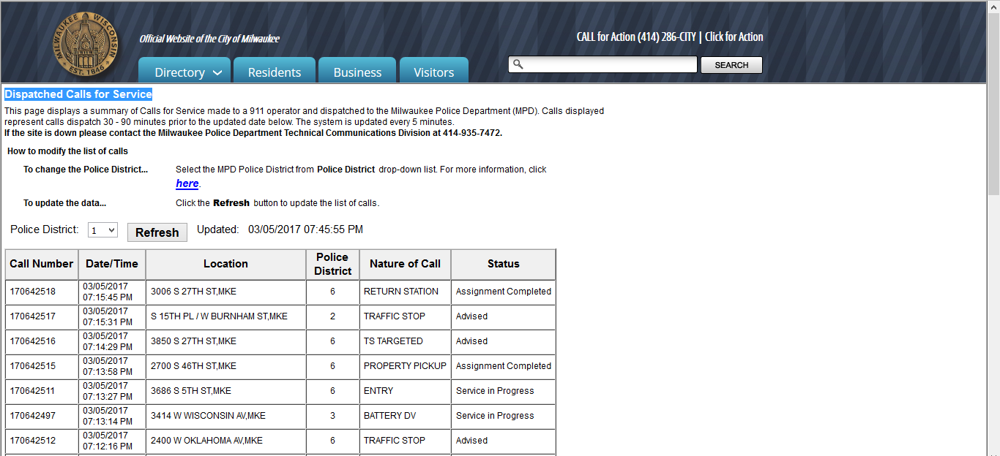

# MKEPDScraper.gs
MKE Dispatched Calls for Service - Google Scripts -> Google Sheets Scraper. Scrapes data from goo.gl/8kRAFC and can be viewed live  @ goo.gl/sQAHzi | I hope to visualize the data in a map format to show dispatch calls on Google Maps.

# Pulls Data From:

# Stores Data To:

